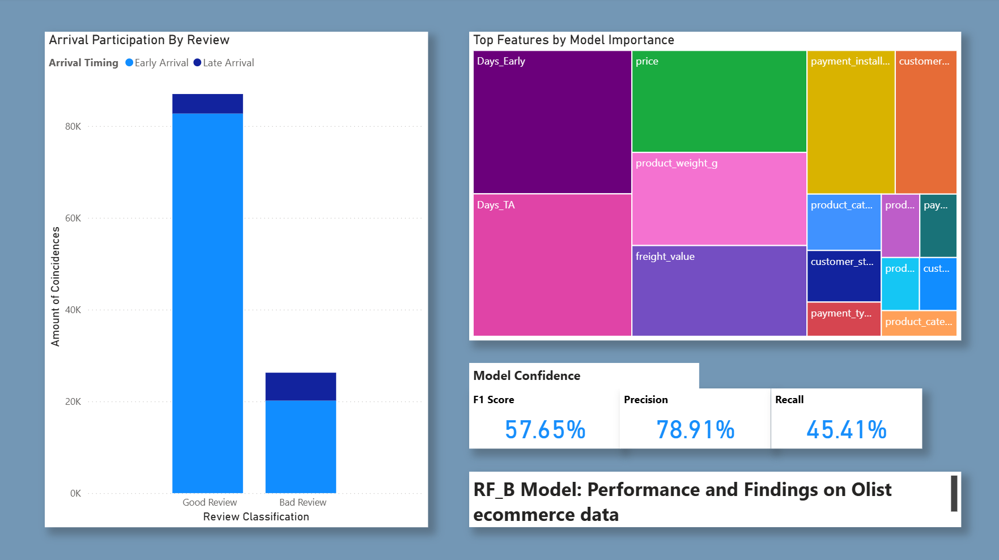
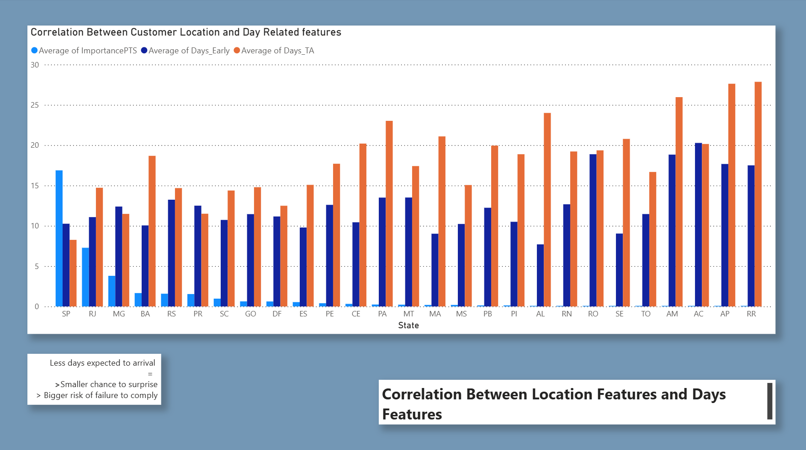

## Note:

This project is shared as a demonstration of technical proficiency and as part of an ongoing optimization process. It is understood that this work is not final and that there is usually room for refinement as more time and analysis are invested. The notebook itself includes a **Experimental Playground** section where current ideas are being tested. Future updates are expected.

# Brazilian Ecommerce Review Analysis

This project analyzes real-world data from Brazilian e-commerce transactions, focusing on customer reviews. The main objective is to build an **interpretable model** that explains the key factors behind positive and negative customer feedback, helping guide business decisions and service improvements.

## Data Source

The data comes from **Olist**, a Brazilian online retail platform, and includes anonymized information about customer orders, products, payments, reviews, and logistics.

## Project Overview

- The project includes an initial **Exploratory Data Analysis (EDA)** section to understand the data structure and quality.
- A detailed **data preprocessing** section follows, carefully preparing the dataset for both linear and tree based models.
- The **model testing and calibration** section evaluates different models, with a focus on interpretability rather than pure predictive accuracy.
- Finally, the project uses the selected model to **explore business insights**, identifying key factors that influence customer reviews.

## Key Notes

- The analysis focuses on **explainability over predictive accuracy**.
- The goal is to identify the most impactful variables on customer satisfaction, particularly those leading to negative reviews.
- All results are reproducible with the provided datasets and notebook.

## Quick View

For a quick visualization of the relevant code, you can go directly to the `Notebook` folder and open the `Brasil_ECom.ipynb` file using GitHub's online viewer. The dashboard can be seen below this text. No need to download anything.

## Dashboard Overview

The main results are summarized in the following dashboards:

- **Page 1:** 
- **Page 2:** 

The `.pbix` file is also included for deeper exploration `Dashboard/RF_B(43)Olist.pbix`

## Ongoing/Pending Updates and Corrections

The following improvements are planned for future revisions:
- The most recent findings suggest that failing to meet expectations or successfully exceeding them is the main driver of reviews. This may sound obvious, but the key is to declare A and deliver B, where B > A, but never B < A.
- Reevaluate the actual relevance and contribution of the `Days_TA` variable. **UPDATE:** It was found that this variable is relevant, likely because a longer window increases the chance to "surprise" the customer with an early delivery. Since the model is Random Forest, collinearity between `Days_TA` and `Days_Early` is not considered a problem.
- Assess the benefits of transforming `Days_Early` into a binary feature instead of using it as a continuous variable. **UPDATE:** This did not improve the model.
- Explore an alternative analysis focused entirely on **product characteristics**, excluding all delivery-related features.
- Improve the dashboard by adding a page 2 for a more feature focused analysis.
- Improve the dashboard by limiting  features showcase  to top 10-15.
- Location related categories may be relevant not because of customer profile, but rather due to a direct correlation with `Days_TA`, which increases the opportunity window to surprise the customer with early delivery.
